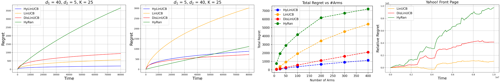

Official Code base for the paper [_Linear Contextual Bandits with Hybrid Payoff: Revisited_](https://drive.google.com/file/d/1WBSkGySeW7t7uCaWlMlLVM3gqK4YQEhs/view?usp=drive_link) by [Nirjhar Das](https://nirjhar-das.github.io/) and [Gaurav Sinha](https://sinhagaurav.github.io/).

## Installation
The code base has dependency on basic packages listed in [requirements.txt](./requirements.txt). The code was tested in conda environment but we believe it can be run without conda as long as the required packages are present. They can be installed via the following command:
```
$ conda create -n Bandit python=3.10
$ conda activate Bandit
$ pip install -r requirements.txt
```

For running the experiments with the [Yahoo! Dataset](https://webscope.sandbox.yahoo.com/catalog.php?datatype=r&did=49), the data must be downloaded from the website. The dataset is available for download in a zipped folder which contains many zip files inside. The folder should be unzipped and the contained zip files should be placed under `Dataset/Yahoo-Front-Page/R6`. Specifically, the folder structure should look like
```
|-- Dataset
|   |-- Yahoo-Front-Page
|       |-- R6
|           |-- ydata-fp-td-clicks-v1_0.20090501.gz
|           |-- ydata-fp-td-clicks-v1_0.20090502.gz
|           |-- ...
|-- Results
|-- scripts
|-- ...
```

## Usage
This code base implements `HyLinUCB` (Algorithm 1 with modified parameter in the aforementioned paper). Other baseline algorithms that are implemented include `LinUCB`, `DisLinUCB`, `SupLinUCB` and `HyRan`. The references of the baseline algorithms are as follows:

- `LinUCB` from ([Li et al. 2010](https://proceedings.mlr.press/v151/faury22a/faury22a.pdf), [Abbasi-Yadkori et al. 2011](https://papers.nips.cc/paper_files/paper/2011/hash/e1d5be1c7f2f456670de3d53c7b54f4a-Abstract.html))
- `DisLinUCB` from Algorithm 1 of ([Li et al. 2010](https://proceedings.mlr.press/v151/faury22a/faury22a.pdf))
- `SupLinUCB` from ([Chu et al. 2011](https://proceedings.mlr.press/v15/chu11a))
- `HyRan` from ([Kim et al. 2023](https://proceedings.mlr.press/v206/kim23d.html))

The Jupyter notebook [demo.ipynb](./demo.ipynb) implements an example of regret simulation experiement.



To reproduce the results in the paper, run the shell scripts in [scripts](./scripts/) folder.
```
$ bash ./scripts/synthetic.sh
$ bash ./scripts/yahoo.sh
$ bash ./scripts/diversity.sh
```
The first script reproduces the results for the synthetic data experiments in the paper and the second script re-creates the results for the experiments with the [Yahoo! Dataset](https://webscope.sandbox.yahoo.com/catalog.php?datatype=r&did=49). The last shell script reproduces the results for the experiments in Appendix F of the paper.

For the Yahoo! experiment, we also provide the weights of the learnt reward model in the [lin_reg_model_36_6_20.pt](./Results/lin_reg_model_36_6_20.pt) file. This is automatically loaded as $\theta^*, \{\beta^*_i\}_{i \in [K]}$ for the semi-synthetic reward model (see Section 4.2 of the paper). To freshly train the parameters, remove the file from the [Results](./Results/) folder and then run the `yahoo.sh` script.

All outputs are saved in the [Results](./Results/) folder.

## Reference

If you find this work useful in your research, please consider citing it.

~~~bibtex
@inproceedings{das2024linear,
    title={Linear Contextual Bandits with Hybrid Payoff: Revisited},
    author={Das, Nirjhar and Sinha, Gaurav},
    year={2024},
    booktitle={Joint European Conference on Machine Learning and Knowledge Discovery in Databases},
    organization={Springer}
}
~~~